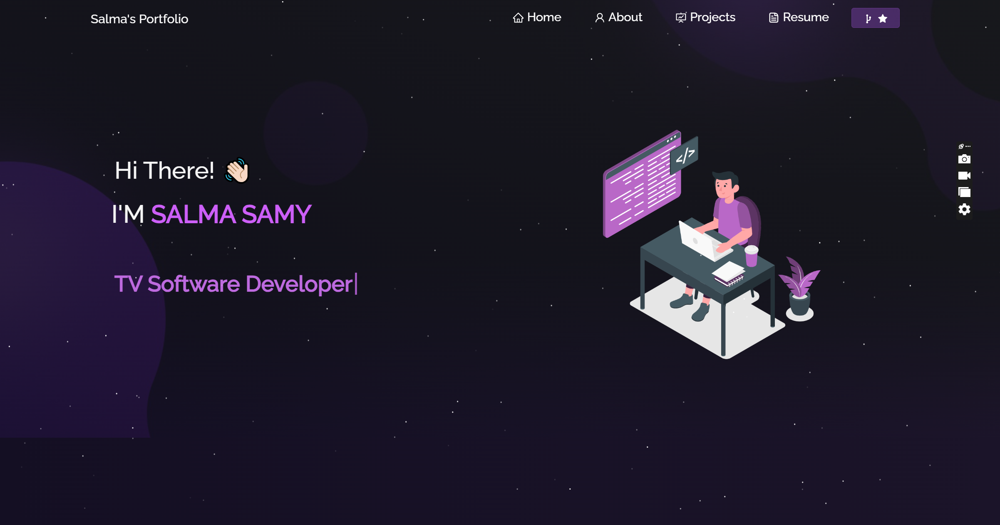

<h2 align="center">
  Salma Samy's Portfolio Website<br/>
  <a href="https://your-deployed-link.com" target="_blank">salma.vercel.app</a>
</h2>
<div align="center">
  
</div>

<br/>

<center>

[](https://forthebadge.com) &nbsp;
[](https://forthebadge.com) &nbsp;
[](https://forthebadge.com) &nbsp;
 &nbsp;


</center>

<h3 align="center">
    🔹
    <a href="https://github.com/SalmaSamyM/Salma-sPortfolio-/issues">Report Bug</a> &nbsp; &nbsp;
    🔹
    <a href="https://github.com/SalmaSamyM/Salma-sPortfolio-/issues">Request Feature</a>
</h3>

## TL;DR

You’re welcome to fork this repo and make your own version. Please give credit by linking back to [SalmaSamyM](https://github.com/SalmaSamyM). Thanks!

## Built With

My personal portfolio <a href="https://your-deployed-link.com" target="_blank">salma.vercel.app</a> which features some of my GitHub projects, resume, and technical skills.

This project was built using:

- React.js
- Node.js
- Express.js
- CSS3
- VS Code
- Vercel

## Features

**📖 Multi-Page Layout**

**🎨 Styled with React-Bootstrap and custom CSS**

**📱 Fully Responsive Design**

## Getting Started

Clone this repository. You’ll need `node.js` and `git` installed globally on your machine.

## 🛠 Installation and Setup Instructions

1. Install dependencies:  
   ```bash
   npm install
